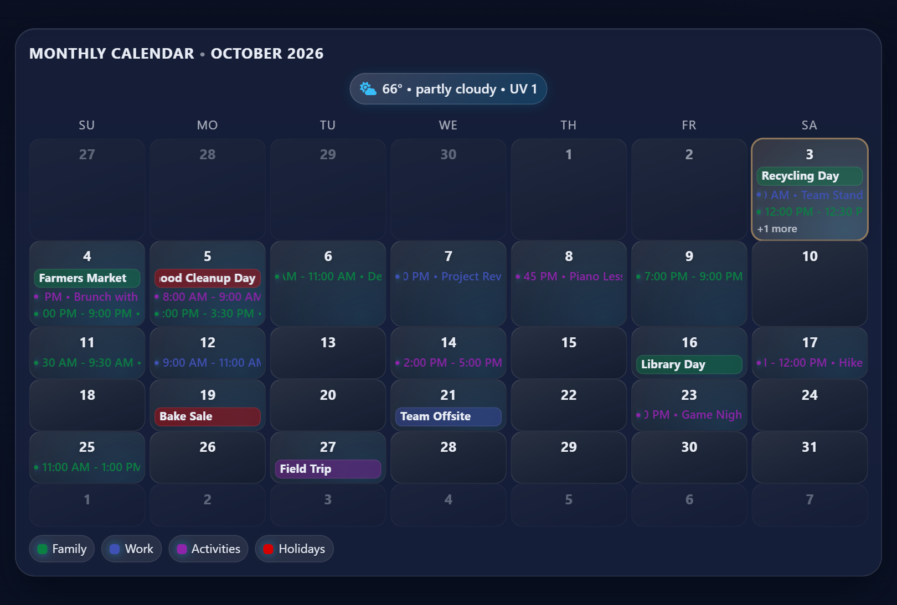

# MMM-GlassCalendar

An iOS-style "liquid glass" monthly calendar module for MagicMirror with ICS/MyAgenda/Calendar support, fuzzy dedupe, heatmap, weather/agenda preview, rich icon mapping, and per-day backgrounds.

## Screenshot



*Month view in the night theme, with sample events from four calendars, the weather row and the calendar legend.*

## Highlights
- ICS via node_helper (RRULE aware) plus optional Calendar/MyAgenda/AmbientWeather payloads.
- Full-day + timed events with keyword icon mapping (Font Awesome, Boxicons, Iconoir SVGs, Iconify).
- Per-calendar visibility toggles, fuzzy dedupe across sources, and heatmap overlay.
- Themes: `dark`, `light`, `auto` (follows the OS/browser `prefers-color-scheme`, evaluated once at render time), `autoSun` (follows MMM-GlassClock's real sunrise/sunset page theme). Contrast-aware icons, adjustable day backgrounds by date or calendar+keyword rules.
- Optional weather row and agenda preview chips; overflow events beyond `maxEventsPerDay` collapse into a "+N more" row by default.

## Requirements
- MagicMirror.
- Local assets:
  - `lib/boxicons/boxicons.min.css` and fonts in `lib/boxicons/fonts/`.
  - `lib/iconoir/` with `iconoir.css` or SVGs (recommended: SVGs as shipped in this repo); reference Iconoir icons by filename without extension.
  - Font Awesome is loaded locally from `node_modules/@fortawesome/fontawesome-free` (run `npm install` in this module's folder) — not from a CDN.

## Installation
```bash
cd ~/MagicMirror/modules
git clone https://github.com/hearter20176/MMM-GlassCalendar.git
cd MMM-GlassCalendar
npm install
```

Ensure the `lib/` assets above are present and `npm install` has fetched `@fortawesome/fontawesome-free`.

## Update

```bash
cd ~/MagicMirror/modules/MMM-GlassCalendar
git pull
npm install --omit=dev
```

Then restart MagicMirror (for example `pm2 restart MagicMirror`).

## Configuration
In `config/config.js`:
```js
{
  module: "MMM-GlassCalendar",
  position: "middle_center",
  config: {
    header: "Monthly Calendar",
    locale: "en",
    firstDayOfWeek: 0,
    monthOffset: 0,               // 0 = current month, 1 = next month, -1 = previous, etc.
                                   // run a second instance with a different offset/identifier
                                   // to show two months side by side

    // Sources
    useCalendarModule: false,
    useMyAgenda: true,
    useAmbientWeather: true,
    icalSources: [
      { url: "https://example.com/holidays.ics", name: "Holidays", color: "#38bdf8" }
    ],

    // Visuals
    theme: "autoSun",            // "dark" | "light" | "auto" (OS prefers-color-scheme) | "autoSun" (page sunrise/sunset)
    sunriseHour: 7,               // fallback only, see note below
    sunsetHour: 19,               // fallback only, see note below
    heatmapEnabled: true,
    heatmapMaxEvents: 6,
    showWeekNumbers: false,
    highlightToday: true,
    dimPastDays: true,
    performanceProfile: "auto",  // "auto" | "pi" | "full"
    reduceMotion: false,         // true disables marquee/heatmap on Pi or reduced-motion

    // Events
    maxEventsPerDay: 6,           // default is 3; the Pi performance profile caps it at 2
    showOverflowIndicator: false, // default true: shows "+N more" for events past maxEventsPerDay
    eventIcons: {
      birthday: { type: "fa", icon: "fa-solid fa-cake-candles" },
      flight:   { type: "box", icon: "bx bx-plane-alt" },
      office:   { type: "iconoir", icon: "briefcase" },
      run:      { type: "iconify", icon: "mdi:run" }
    },
    calendarVisibility: { "Holidays": true },

    // Day backgrounds
    dayBackgrounds: {
      "2025-12-25": "/img/christmas.jpg"
    },
    dayBackgroundRules: [
      { calendar: "holiday", keyword: "christmas", image: "/img/christmas.jpg" }
    ],

    // Extras
    showAgendaPreview: true,
    maxAgendaPreviewItems: 4,
    showWeatherRow: true,
    updateInterval: 15 * 60 * 1000,
    animationSpeed: 400,
    marqueeSpeed: 20               // px/s scroll speed for event titles too long to fit
  }
},
```

### Options

| Option | Type | Default | Description |
| --- | --- | --- | --- |
| `header` | string | `"Monthly Calendar"` | Title shown at the top of the card, followed by the month and year. |
| `locale` | string | `"en"` | Moment.js locale for month, weekday and time text. |
| `firstDayOfWeek` | number | `0` | First column of the grid: `0` = Sunday, `1` = Monday. |
| `monthOffset` | number | `0` | Month to show relative to the current one (`1` = next month, `-1` = previous). Run a second instance with a different offset to show two months. |
| `useCalendarModule` | boolean | `false` | Also take events from MagicMirror's default calendar module (`CALENDAR_EVENTS`). |
| `useMyAgenda` | boolean | `true` | Also take events from MMM-MyAgenda (`MYAGENDA_EVENTS`). |
| `useAmbientWeather` | boolean | `true` | Use MMM-AmbientWeather's `AMBIENT_WEATHER_DATA` for the weather row and the `autoSun` fallback. |
| `icalSources` | array | `[]` | ICS feeds fetched by the node helper. Each entry: `url` (string, or an array of URLs fetched separately), `name`, `color`, and optionally `timeZone` with `forceTimeZone: true` (see Timezone handling). |
| `highlightToday` | boolean | `true` | Outline today's cell. |
| `dimPastDays` | boolean | `true` | Dim days before today. |
| `showWeekNumbers` | boolean | `false` | Add an ISO week-number column. |
| `maxEventsPerDay` | number | `3` | Events listed per day cell (the `pi` profile caps this at 2). |
| `showOverflowIndicator` | boolean | `true` | Show "+N more" for events past `maxEventsPerDay`. |
| `showAgendaPreview` | boolean | `true` | Show upcoming MMM-MyAgenda items as chips under the grid. |
| `maxAgendaPreviewItems` | number | `4` | Number of agenda preview chips. |
| `showWeatherRow` | boolean | `true` | Show the current-conditions chip above the grid. |
| `heatmapEnabled` | boolean | `true` | Tint each day by how busy it is. |
| `heatmapMaxEvents` | number | `6` | Event count that gives the full heatmap tint. |
| `heatmapColor` | string | `"#38bdf8"` | Heatmap tint colour. |
| `dayBackgrounds` | object | `{}` | Map of `YYYY-MM-DD` to an image (see Day backgrounds). |
| `dayBackgroundRules` | array | `[]` | Calendar/keyword rules that set a day's background image (see Day backgrounds). |
| `eventIcons` | object | `{}` | Keyword to icon map (see Icon types). |
| `calendarVisibility` | object | `{}` | Map of calendar name to `true`/`false`; `false` hides that calendar. |
| `theme` | string | `"autoSun"` | `"dark"`, `"light"`, `"auto"` (OS `prefers-color-scheme`) or `"autoSun"` (follows MMM-GlassClock's day/night page theme). |
| `sunriseHour` / `sunsetHour` | number | `7` / `19` | Whole-hour fallback for `autoSun` when no page theme class is present. |
| `marqueeSpeed` | number | `20` | Scroll speed in px/s for event titles too long to fit. |
| `performanceProfile` | string | `"auto"` | `"auto"` (detects Pi/ARM), `"pi"` (low motion, debounced redraws, capped events) or `"full"`. |
| `reduceMotion` | boolean | `false` | Disable marquee and heatmap motion (also follows `prefers-reduced-motion`). |
| `updateInterval` | number | `900000` | ICS refresh interval in ms (15 minutes). |
| `animationSpeed` | number | `400` | DOM update fade in ms. |

### Icon types
- `fa`: Font Awesome class string, e.g. `fa-solid fa-car`.
- `box`: Boxicons class string, e.g. `bx bx-run`.
- `iconoir`: Iconoir SVG filename (no extension), e.g. `calendar-check`; ensure the SVG exists in `lib/iconoir/`.
- `iconify`: Any Iconify icon id, e.g. `mdi:airplane`.

### Day backgrounds
- `dayBackgrounds`: map of `YYYY-MM-DD` -> image path/URL (string). If not wrapped with `url()`, it will be auto-wrapped.
- `dayBackgroundRules`: array of `{ calendar?, keyword?, image }`. If any event for that day matches the calendar substring and keyword in the title, the image is applied.
- Use browser-visible paths (e.g., `/modules/MMM-GlassCalendar/img/snow.jpg` or another served URL).

### Performance options
- `performanceProfile`: `"auto"` (detect Pi/ARM), `"pi"` (force low-motion, debounce DOM, cap per-day events), `"full"` (keep all visuals).
- `reduceMotion`: Force-disable marquee/heatmap motion even on non-Pi devices (also triggered by `prefers-reduced-motion`).
- `maxEventsPerDay` + `showOverflowIndicator`: lowering the cap reduces DOM nodes on low-power devices.

### Theme modes
- `"auto"` follows the OS/browser `prefers-color-scheme` media query, checked once when the card renders (there's no live listener for a mid-session OS theme change). Electron on Raspberry Pi OS usually reports `light` unless the system is explicitly set to dark mode.
- `"autoSun"` (see below) is unrelated to `"auto"` — it derives day/night from real sunrise/sunset instead of the OS setting, and is the default.

### Page theme sync (autoSun)
- With `theme: "autoSun"`, the card first checks `<body>` for `mm-day` / `mm-night`, set by MMM-GlassClock from real sunrise/sunset for the current date. This keeps the card's light/dark state identical to the rest of the page.
- `sunriseHour` / `sunsetHour` (and the weather-summary sunrise/sunset hours) are only used as a fallback when neither body class is present (e.g. MMM-GlassClock isn't installed or `themeClass` is disabled there).
- The card listens for MMM-GlassClock's `PAGE_THEME_CHANGED` notification and re-renders (via `queueDomUpdate`, respecting the performance debounce) so it flips at the same moment as the page.

### Fetch errors
- **"Calendar unavailable"** appears only while the card has never successfully loaded (`!loaded`, i.e. before its first `GLASSCALENDAR_EVENTS`) and at least one source has already errored. It's a loading-time state, not a summary of the final result — once the first fetch cycle completes, the header always switches to "Updated ..." or the "N of M" count below, even if every source failed.
- **"N of M calendars failed"** (warning-colored) appears once the card has loaded and any source has errored on this or a later cycle, replacing "Updated ...". `M` counts expanded URLs (a single configured source with an array `url: [...]` is fetched once per URL by node_helper, and each can fail independently), not the number of entries in `icalSources`.
- The node_helper never sends the raw ICS URL to the front end on error — only the source `name` (or a token-masked URL if no name is set) — since private ICS URLs grant calendar read access.

## Animation lifecycle
- Long event titles scroll with Web Animations on a per-title loop. Every animation is tracked with its title element; when MagicMirror swaps the old render out (`MODULE_DOM_UPDATED`, with a short bounded poll as fallback) the animations of the detached tree are cancelled so old render trees are never retained. Animations are never cancelled while their tree is still on screen, including when MagicMirror skips an identical re-render.
- `suspend()` (page hidden by MMM-pages) pauses the marquees and the card CSS animations; `resume()` plays them. Animations created while hidden start paused. State is per module instance, so several calendars can run at once.

## Timezone handling
- ICS parsing applies calendar timezones to recurring and floating events, preventing early/late shifts across calendars.
- Set `timeZone` plus `forceTimeZone: true` on a source to pin floating times (DTSTART without TZ) and render times in that zone even if the host timezone differs.

## Tests
- Install dependencies: `npm install`
- Run all tests (timezone coverage): `npm test`
- Run a specific file: `node --test __tests__/timezone.test.js`

## Styling Notes
- Card uses a liquid glass shimmer and full-width layout in `middle_center`.
- Heatmap and day backgrounds sit behind content; all events render with contrast-aware icons.
- Legend uses brighter text with a subtle shadow for readability.

## Release Checklist (manual)
1. Verify assets present (`lib/boxicons`, `lib/iconoir` SVGs, `node_modules/@fortawesome/fontawesome-free`).
2. Run a quick MagicMirror load to ensure no console errors.
3. Update version in `package.json` (and `package-lock.json` if used): `npm version <new>` (skip git tagging if undesired).
4. Commit changes, tag release: `git tag vX.Y.Z`.
5. Publish GitHub release with changelog (features, fixes, breaking changes, asset requirements).

## License
MIT
